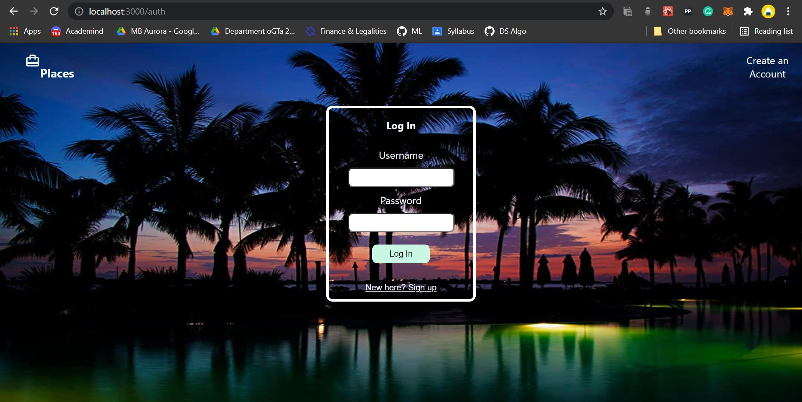
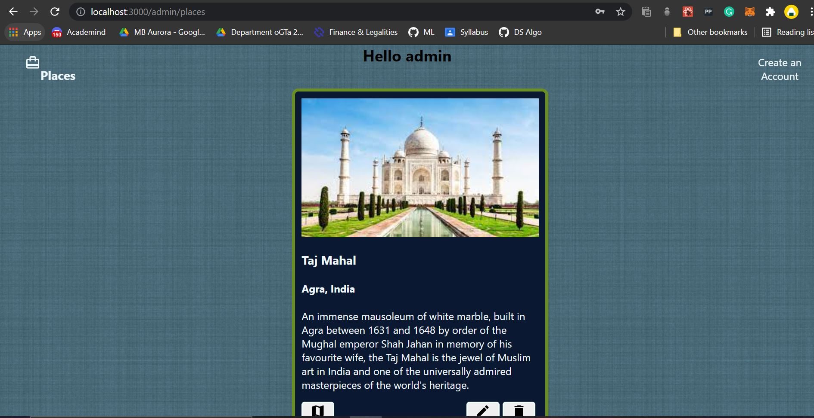

Here's the edited and improved version for your GitHub README:  

---

# 🌍 Places Web App  

A full-stack web application for sharing and managing posts about places with map integration using the **Google Maps API**.  

---

## 🚀 Technologies Used  

1. **ReactJS** - Frontend  
2. **Material UI** - Styling  
3. **Node.js with Express** - Backend  
4. **MongoDB** - Database  

---

## 📖 Features  

- User Registration and Login  
- Add, Edit, or Delete Place Posts  
- View Places on a Map  

---

## 🛠️ How to Run  

1. **Clone/Download the Repository**  
   ```bash
   git clone <repository-link>
   cd places-web-app
   ```

2. **Install Dependencies**  
   ```bash
   npm install
   ```

3. **Run the Development Server**  
   ```bash
   npm run dev
   ```  

4. **Run Only the Client Side**  
   Navigate to the client folder:  
   ```bash
   cd client
   npm start
   ```  

---

## 💻 How It Works  

1. **Sign Up**: Register on the platform to create an account.  
2. **Login**: Access your personalized dashboard.  
3. **Add a Post**: Share details about a place, including its description and location.  
4. **Manage Posts**:  
   - **Edit**: Update your post details.  
   - **Delete**: Remove a post.  
   - **View on Map**: Visualize the place on Google Maps.  

---

## 📸 Snapshots  

**Authentication Page:**  
  

**Main Page:**  
  

---

Feel free to explore and contribute! 🌟  

